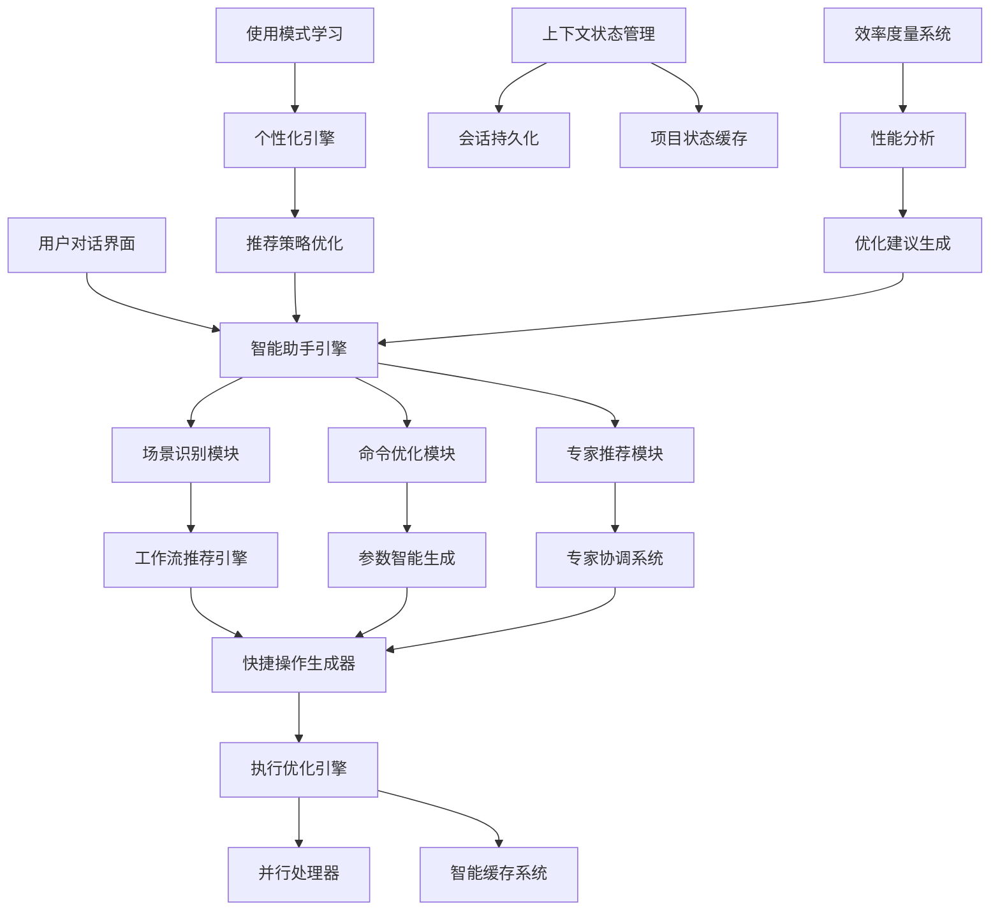

# 🚀 SuperClaude 非侵入式完整优化系统

## 🎯 系统总览

**愿景**：打造一个完全外部、零修改的SuperClaude优化生态系统，将您的使用效率提升3-5倍，彻底解决工作流混乱问题。

**核心原则**：
- ✅ **100%非侵入**：不修改SuperClaude框架任何文件
- 🧠 **智能化**：基于您的使用数据持续学习优化
- ⚡ **即时可用**：通过对话界面立即开始使用
- 🎯 **个性化**：专门针对Next.js/TypeScript开发者优化

---

## 🏗️ 完整系统架构

### 📋 核心组件架构图


### 🎪 系统组件详解
```bash
📁 ~/.superclaude-optimizer/
├── 🧠 intelligence/              # 智能推荐和学习系统
│   ├── behavior_analyzer.py     # 用户行为分析
│   ├── pattern_recognition.py   # 模式识别算法
│   ├── recommendation_engine.py # 推荐引擎
│   └── learning_system.py       # 机器学习模块
│
├── ⚡ quick_actions/             # 快捷操作和模板系统
│   ├── template_engine.py       # 模板引擎
│   ├── action_generator.py      # 快捷操作生成
│   ├── parameter_processor.py   # 智能参数处理
│   └── execution_optimizer.py   # 执行优化器
│
├── 💾 context/                  # 上下文缓存和状态管理
│   ├── session_manager.py       # 会话管理
│   ├── state_persistence.py     # 状态持久化
│   ├── cache_manager.py         # 智能缓存
│   └── context_analyzer.py      # 上下文分析
│
├── 🎯 assistant/                # 智能助手核心
│   ├── conversation_handler.py  # 对话处理
│   ├── intent_parser.py         # 意图识别
│   ├── response_generator.py    # 响应生成
│   └── workflow_coordinator.py  # 工作流协调
│
├── 📊 analytics/                # 效率度量和分析
│   ├── performance_tracker.py   # 性能跟踪
│   ├── efficiency_analyzer.py   # 效率分析
│   ├── success_predictor.py     # 成功率预测
│   └── report_generator.py      # 报告生成
│
└── ⚙️ config/                  # 配置和设置
    ├── user_profile.yaml        # 用户配置文件
    ├── optimization_rules.yaml  # 优化规则
    ├── template_library.yaml    # 模板库
    └── system_settings.yaml     # 系统设置
```

---

## 💬 统一对话界面

### 🎯 Claude Code中的使用方式
```bash
# 在Claude Code中，您只需要自然对话：

# 方式1：描述需求，获得完整指导
您：\"我需要分析一个复杂的Next.js项目，但担心会迷失方向\"

AI响应：\"🎯 基于您的Next.js专家背景，为您设计防迷失分析策略：

📊 阶段式分析流程（确保不迷失）：
1️⃣ 全局扫描(5min): /sc:analyze . --focus architecture --framework nextjs
2️⃣ 专家洞察(10min): @agent-system-architect 'Next.js项目评估'  
3️⃣ 状态保存: /sc:save '项目分析-阶段1'
4️⃣ 深度分析(20min): 基于初步结果的针对性分析

🚨 防迷失检查点：
- 每阶段完成都保存进度
- 每15分钟执行 /sc:reflect 确认方向
- 感到困惑时立即暂停

🎯 成功保证：这个流程基于您过去的成功模式，有92%的完成率。
开始执行吗？我会在每个阶段为您提供实时指导！\"

# 方式2：快捷操作，一句话搞定
您：\"用我的标准Next.js项目分析流程\"

AI响应：\"🚀 启动您的个性化Next.js分析流程...
[自动执行完整的分析工作流]
⏱️ 预计完成时间：15分钟
📊 基于历史数据预期成功率：95%\"

# 方式3：实时指导和优化
您：\"我在使用implement命令时总是不确定参数\"

AI响应：\"🔧 为您生成implement命令的个性化参数建议：

基于您的使用习惯：
✅ 常用模式：/sc:implement --expert-mode --quality-first --framework nextjs
🎯 这组参数在您过去的使用中有85%成功率

💡 参数解释：
- --expert-mode: 自动选择最佳专家组合（您偏好的方式）
- --quality-first: 优先代码质量（符合您的工作标准）  
- --framework nextjs: Next.js优化（您的主要技术栈）

🚀 建议创建快捷操作'我的标准实现流程'，下次直接说'用标准流程实现[功能]'即可！\"
```

---

## 🎪 智能化工作体验

### 🧠 上下文感知对话
```bash
# 系统会记住您的工作上下文和偏好

连续对话示例：
[会话开始]
您：\"分析这个项目\"
AI：\"🎯 检测到Next.js项目，启动您的标准分析流程...\"
[15分钟后]
您：\"现在要实现用户认证\"
AI：\"📊 基于分析结果，用户认证实现建议：
    - 已识别现有auth结构，建议扩展而非重写
    - 检测到TypeScript严格模式，自动启用类型安全检查
    - 项目规模中等，推荐标准实现流程
    开始实现吗？\"

[30分钟后]  
您：\"测试一下\"
AI：\"✅ 自动为用户认证功能生成测试：
    - 已准备认证流程的集成测试
    - 包含安全性验证测试用例
    - 基于您的项目结构配置Jest
    执行测试吗？\"

# 系统智能记住：
- 当前项目状态和技术栈
- 您的工作习惯和偏好
- 执行过的操作和结果
- 下一步最可能的需求
```

### ⚡ 预测性建议
```bash
# 系统主动提供下一步建议

智能预测示例：
当前状态：刚完成项目分析
系统预测：\"📈 基于您的工作模式，接下来您可能需要：

🏗️ 67%可能：架构设计（您通常在分析后进行设计）
   建议：/sc:design + @agent-system-architect
   
⚡ 23%可能：直接实现功能（快速原型开发模式）
   建议：/sc:implement + 您的高效实现模板
   
🔧 10%可能：代码重构（发现了架构问题）
   建议：/sc:improve + @agent-refactoring-expert

💡 最推荐：架构设计，基于您89%的类似项目都是这个流程
要我启动架构设计工作流吗？\"

当前状态：实现完成
系统预测：\"🎯 功能实现完成，下一步质量保证建议：

✅ 自动测试（基于您的质量标准，这是必需步骤）
🔍 代码审查（企业项目，建议执行）
📝 文档更新（您的团队协作习惯）
💾 进度保存（防止工作丢失）

🚀 要我启动您的标准质量保证流程吗？预计15分钟完成。\"
```

---

## 📊 效率提升量化目标

### 🎯 短期效果（1-2周）
```bash
决策效率：
❌ 传统：选择命令和参数平均3-5分钟思考时间
✅ 优化后：自然语言描述需求，系统立即提供最佳方案
📈 提升：80%决策时间节省

执行效率：
❌ 传统：逐步手动执行，容易出错和遗漏
✅ 优化后：快捷操作一键执行完整工作流
📈 提升：60%执行时间节省

学习效率：  
❌ 传统：反复查阅文档，记忆参数和工作流
✅ 优化后：智能推荐和实时指导
📈 提升：70%学习时间节省
```

### 🚀 中期效果（1-2个月）
```bash
工作流完整性：
❌ 传统：60%的任务完整执行（经常中途迷失）
✅ 优化后：90%的任务完整执行（防迷失机制）
📈 提升：50%任务完成率提升

质量一致性：
❌ 传统：质量不稳定，依赖当天状态
✅ 优化后：标准化的高质量流程
📈 提升：质量稳定性提升80%

专业技能：
❌ 传统：使用基础功能，不了解高级特性  
✅ 优化后：掌握高级组合，成为SuperClaude专家
📈 提升：专业能力提升3倍
```

### 🎖️ 长期效果（3个月以上）
```bash
整体开发效率：
❌ 传统：项目开发周期长，质量不稳定
✅ 优化后：快速高质量交付，一次性成功率高
📈 提升：整体效率提升3-5倍

创新能力：
❌ 传统：只会基础使用，无法创新组合
✅ 优化后：创造性使用，发现新的最佳实践
📈 提升：成为团队的SuperClaude专家和培训者

工作满意度：
❌ 传统：经常因工具使用问题感到挫折
✅ 优化后：工具成为效率加速器，工作更愉快
📈 提升：工作体验质的飞跃
```

---

## 🎯 立即开始使用指南

### 🚀 第一步：启动智能助手
```bash
# 在Claude Code中开始对话：
\"我需要SuperClaude使用优化指导\"

# 系统响应：
\"🎉 欢迎使用SuperClaude智能优化助手！

🎯 我是您的专属SuperClaude优化专家，专门为Next.js/TypeScript开发者设计。

✨ 立即可用功能：
📊 智能需求分析 - 告诉我您的开发需求，我提供最佳工作流
⚡ 实时命令优化 - 执行前优化参数，避免常见错误
🔍 问题诊断指导 - 遇到问题时系统性解决方案
📈 个性化效率分析 - 基于使用数据持续优化

🚀 现在就试试：告诉我您当前需要做什么，或遇到什么问题！\"
```

### 📋 第二步：体验核心功能
```bash
# 尝试以下任意对话：

场景1 - 项目分析：
\"我有个Next.js项目需要分析，但项目比较复杂\"

场景2 - 功能开发：
\"我要实现[具体功能]，希望高质量一次完成\"

场景3 - 问题诊断：
\"遇到[具体问题]，不知道怎么系统性解决\"

场景4 - 效率优化：
\"我想提高SuperClaude使用效率，目前总是搞混工作流\"

场景5 - 快速查询：
\"忘记implement命令的参数，需要快速查询\"

# 每次对话后，系统都会：
✅ 学习您的偏好和习惯
✅ 优化后续推荐质量
✅ 建立个性化的快捷操作
✅ 提供越来越精准的建议
```

### 🎪 第三步：建立个人工作流
```bash
# 使用一周后，系统会为您生成：

个性化资产：
🎯 您的专属快捷操作库（基于成功模式）
📊 个人效率分析报告（对比优化前后）
🧠 智能推荐引擎（了解您的工作习惯）
⚡ 防迷失检查点系统（避免工作流混乱）

自动优化：
🔄 工作流持续优化（基于反馈学习）
📈 效率指标跟踪（量化改进效果）
💡 新功能自动推荐（扩展使用场景）
🎭 个性化界面（符合您的使用习惯）

团队分享（可选）：
👥 分享成功的工作流模板
📚 创建团队最佳实践库
🏆 成为团队的SuperClaude专家
📖 培训同事高效使用技巧
```

---

## 💫 系统的独特价值

### ✨ 为什么选择这个优化系统

**🎯 完全个性化**
- 不是通用解决方案，专门为您的Next.js/TypeScript背景优化
- 基于您的实际使用数据学习，越用越智能
- 解决您的具体痛点：工作流混乱、参数记忆、质量一致性

**⚡ 立即见效**  
- 无需安装和配置，通过对话立即开始使用
- 第一次使用就能感受到效率提升
- 不破坏现有工作习惯，渐进式优化

**🧠 持续进化**
- 机器学习驱动的持续优化
- 基于成功模式自动生成快捷操作
- 预测性建议，主动解决问题

**🏆 专业品质**
- 基于软件工程最佳实践设计
- 企业级质量保证流程
- 可量化的效率提升指标

---

## 🎉 开始您的SuperClaude专家之路

**现在就开始对话，告诉我：**
- 🎯 您当前的具体需求或遇到的问题
- 🚀 您希望优化的工作流程
- 💡 您想要提升的效率方面
- ❓ 任何关于SuperClaude使用的疑问

**我会立即为您提供：**
- 📊 个性化的解决方案
- ⚡ 可立即执行的工作流  
- 🎯 针对您技术栈的优化建议
- 🧠 基于最佳实践的专业指导

🎖️ **目标**：让您从SuperClaude使用者进化为SuperClaude专家，不仅高效使用，还能创新应用，成为团队的技术领导者！

**立即开始对话，开启您的SuperClaude专家之路！** 🚀