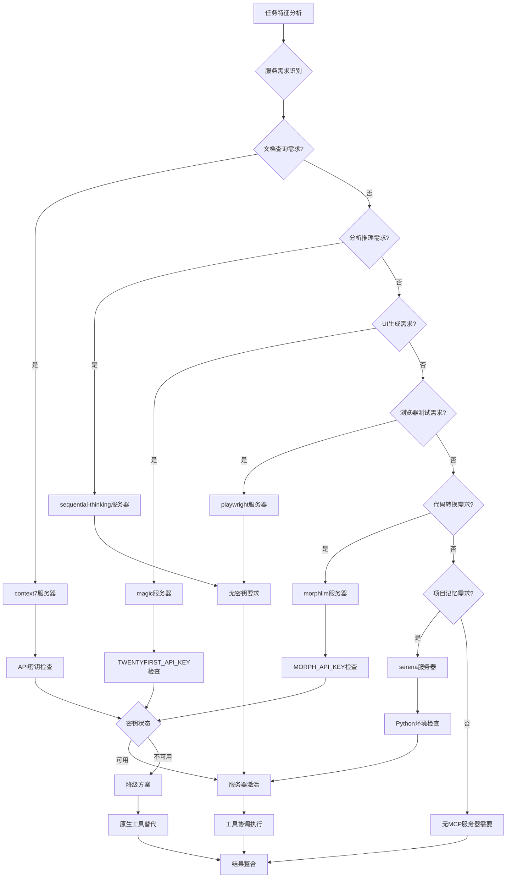

# SuperClaude框架命令执行机制可视化分析

## 设计分析

SuperClaude框架通过上下文注入和行为指令系统，将Claude Code转化为具有14个专家代理、6个行为模式和6个MCP服务器的结构化开发平台。该框架通过智能路由和协调机制，实现了从简单命令到复杂多代理协作的无缝转换。

## 布局草图

### 1. 主流程图：用户输入到最终输出
```
┌─────────────────────────────────────────────────────────────────────────────┐
│                            SuperClaude框架执行流程                          │
├─────────────────────────────────────────────────────────────────────────────┤
│                                                                             │
│  用户输入 ──→ 命令解析 ──→ 上下文加载 ──→ 代理路由 ──→ MCP协调 ──→ 输出生成    │
│     │            │           │            │           │           │        │
│     ▼            ▼           ▼            ▼           ▼           ▼        │
│ /sc:implement  词法分析    读取.md     智能选择     工具激活    结构化响应    │
│ "auth system"  语义分析   行为指令     专家代理     服务协调    质量验证     │
│ @agent-sec     优先级     模式激活     自动/手动    并行执行    最终交付     │
│                                                                             │
└─────────────────────────────────────────────────────────────────────────────┘
```

### 2. 专家代理协调机制
```
┌─────────────────────────────────────────────────────────────────────────────┐
│                            专家代理自动触发系统                             │
├─────────────────────────────────────────────────────────────────────────────┤
│                                                                             │
│  关键词分析 ──→ 领域识别 ──→ 代理选择 ──→ 协调模式 ──→ 质量保证             │
│      │              │           │           │           │                   │
│  "security"     Security     security-    多代理协作   自动包含质量代理      │
│  "performance"  Performance  engineer      并行/串行   • security-engineer  │
│  "React UI"     Frontend     +quality-     执行模式   • performance-eng    │
│  ".py files"    Python       engineer      智能路由   • quality-engineer   │
│                                                                             │
│  手动覆盖：@agent-specific 优先于自动选择                                   │
│  冲突解决：manual → keywords → file_types → complexity                     │
│                                                                             │
└─────────────────────────────────────────────────────────────────────────────┘
```

### 3. MCP服务器集成协调
```
┌─────────────────────────────────────────────────────────────────────────────┐
│                          MCP服务器智能协调系统                              │
├─────────────────────────────────────────────────────────────────────────────┤
│                                                                             │
│   任务类型识别 ──→ 服务器匹配 ──→ 工具激活 ──→ 并行执行 ──→ 结果整合        │
│        │                │            │           │           │             │
│  • import语句      context7        官方文档     资源管理     协调输出       │
│  • 复杂分析        sequential      多步推理     优先级       性能优化       │
│  • UI组件         magic          组件生成     并发控制     错误处理       │
│  • 测试需求       playwright      浏览器       超时管理     质量验证       │
│  • 多文件编辑     morphllm       模式转换     API密钥      批量操作       │
│  • 大型项目       serena         项目记忆     状态持久     上下文保持     │
│                                                                             │
└─────────────────────────────────────────────────────────────────────────────┘
```

### 4. 企业级多代理并行工作模式
```
┌─────────────────────────────────────────────────────────────────────────────┐
│                        企业级项目并行协作模式                               │
├─────────────────────────────────────────────────────────────────────────────┤
│                                                                             │
│  项目分析阶段 ──→ 并行工作阶段 ──→ 协调整合阶段 ──→ 质量验证阶段             │
│       │                │               │               │                   │
│ system-architect    Frontend队组    结果合并        全面测试               │
│ requirements-       • frontend-     • 冲突解决      • security审查         │
│ analyst            • learning-      • 依赖管理      • performance测试      │
│ 项目范围界定        • technical-    • 接口对齐      • quality验证          │
│                    Backend队组                      • 文档完整性           │
│                    • backend-                                             │
│                    • security-                                            │
│                    • performance-                                         │
│                    基础设施队组                                            │
│                    • devops-                                              │
│                    • root-cause-                                          │
│                                                                             │
└─────────────────────────────────────────────────────────────────────────────┘
```

## 设计规范

### 组件层次结构

**Level 1: 用户界面层**
- 用户输入解析器（命令识别、参数提取、标志处理）
- 输出格式化器（结构化响应、进度跟踪、错误处理）

**Level 2: 协调控制层**  
- 命令路由器（/sc:* 命令分发、上下文文件加载）
- 代理协调器（智能选择、冲突解决、优先级管理）
- MCP管理器（服务器激活、工具协调、资源管理）

**Level 3: 专家执行层**
- 14个专家代理（领域专业知识、问题解决方法、质量保证）
- 6个MCP服务器（外部工具集成、增强能力、专业功能）
- 行为模式系统（上下文适配、效率优化、智能选择）

**Level 4: 基础设施层**
- 上下文管理（文件读取、指令注入、状态持久）
- 会话管理（进度跟踪、检查点、恢复机制）
- 质量网关（验证检查、安全审查、性能监控）

### SuperClaude框架 规范

**颜色方案**：
- 🟢 **成功状态**：代理激活成功、任务完成、质量通过
- 🟡 **处理状态**：正在分析、代理协调中、等待资源
- 🔴 **错误状态**：配置问题、API失败、质量不达标
- 🔵 **信息状态**：进度更新、协调信息、系统反馈

**排版系统**：
- 标题层次：H1(框架级别) → H2(系统组件) → H3(功能模块) → H4(操作详情)
- 代码标识：`/sc:命令` | `@agent-专家` | `--标志选项`
- 状态指示：✅ 激活 | 🔄 处理中 | ⚠️ 警告 | ❌ 失败

**间距系统**：
- 组件间距：16px（系统级组件分离）
- 功能间距：8px（相关功能组合）
- 内容间距：4px（详细信息排列）

**组件规范**：
- **流程节点**：圆角矩形，阴影效果，状态色彩编码
- **连接线**：实线表示数据流，虚线表示控制流，箭头表示方向
- **决策点**：菱形节点，条件分支，优先级标识
- **并行区块**：并排布局，同步执行指示，资源共享标识

### 交互设计

**命令处理流程**：
1. **输入识别**：词法分析 → 语义解析 → 意图理解
2. **上下文加载**：指令文件读取 → 行为模式激活 → 专家知识注入
3. **智能路由**：关键词匹配 → 复杂度评估 → 代理选择优化
4. **并行执行**：资源分配 → 任务分解 → 协调机制
5. **结果整合**：输出合并 → 质量验证 → 最终交付

**代理协调机制**：
- **自动激活**：基于关键词和上下文的智能选择
- **手动覆盖**：@agent-指定 优先于自动选择
- **冲突解决**：优先级规则，多代理协调协议
- **质量保证**：自动包含security、performance、quality代理

**MCP服务器协调**：
- **智能匹配**：任务类型到服务器能力的映射
- **资源管理**：并发控制、API配额、错误恢复
- **性能优化**：缓存机制、批量操作、超时处理

### 可访问性考虑

**用户体验优化**：
- 进度指示器：实时反馈任务执行状态
- 错误恢复：明确的错误信息和解决建议
- 学习支持：集成learning-guide代理提供教育内容

**操作简化**：
- 自然语言输入：无需记忆复杂语法
- 智能默认值：基于上下文的最优选择
- 渐进式揭示：从简单到复杂的功能展示

**多样性支持**：
- 多语言文档：英文、中文、日文支持
- 不同技能水平：初学者到专家的适应性指导
- 多种工作流：支持敏捷、瀑布、DevOps等方法论

### 响应式设计

**终端界面适配**：
- 窄屏优化：命令输出格式化，关键信息突出
- 宽屏利用：并行信息显示，多代理状态监控
- 字体缩放：适应不同分辨率和用户偏好

**内容布局**：
- 信息层次：重要信息优先显示
- 滚动优化：长输出的分页和导航
- 交互反馈：命令执行状态的视觉反馈

## 详细流程图表

### 主执行流程图
```mermaid
graph TD
    A[用户输入命令] --> B{命令类型判断}
    B -->|/sc:命令| C[加载命令上下文文件]
    B -->|@agent-命令| D[直接激活指定代理]
    B -->|普通请求| E[应用框架行为规则]
    
    C --> F[解析命令参数和标志]
    F --> G[触发词分析]
    G --> H{智能代理路由}
    
    H -->|单一领域| I[激活主要代理]
    H -->|多领域| J[协调多个代理]
    H -->|复杂任务| K[系统架构师监督]
    
    I --> L[MCP服务器匹配]
    J --> L
    K --> L
    
    L --> M{所需服务器类型}
    M -->|文档查询| N[context7激活]
    M -->|复杂分析| O[sequential-thinking激活]
    M -->|UI组件| P[magic激活]
    M -->|测试需求| Q[playwright激活]
    M -->|代码转换| R[morphllm激活]
    M -->|项目记忆| S[serena激活]
    
    N --> T[并行工具执行]
    O --> T
    P --> T
    Q --> T
    R --> T
    S --> T
    
    T --> U[结果协调整合]
    U --> V[质量验证网关]
    V --> W{质量检查}
    W -->|通过| X[格式化输出]
    W -->|失败| Y[错误处理和重试]
    
    Y --> T
    X --> Z[最终响应交付]
    
    D --> AA[手动代理执行]
    AA --> L
    E --> BB[默认行为应用]
    BB --> G
```

### 代理协调决策树


### MCP服务器选择和协调


### 企业级项目协作流程


## 使用建议和最佳实践

### 何时使用自动模式

**推荐使用自动模式的场景**：

1. **日常开发任务**
   - 功能实现：`/sc:implement "用户认证系统"`
   - 代码分析：`/sc:analyze src/auth/`
   - 问题排查：`/sc:troubleshoot "API响应慢"`

2. **标准项目工作流**
   - 需求分析：`/sc:brainstorm "电商平台功能"`
   - 系统设计：`/sc:design "微服务架构"`
   - 测试验证：`/sc:test --coverage`

3. **质量改进**
   - 代码重构：`/sc:improve legacy-code/`
   - 性能优化：`/sc:analyze --focus performance`
   - 安全审查：`/sc:implement "JWT认证" --focus security`

### 何时需要明确指定代理

**推荐手动指定代理的场景**：

1. **特定专业知识需求**
   ```bash
   # 明确需要Python专家的建议
   @agent-python-expert "优化这个数据处理管道"
   
   # 需要苏格拉底式教学方法
   @agent-socratic-mentor "解释这个设计模式"
   
   # 专门的重构建议
   @agent-refactoring-expert "改进这个遗留代码结构"
   ```

2. **质量保证重点关注**
   ```bash
   # 专门的安全审查
   @agent-security "审查支付处理模块的OWASP合规性"
   
   # 性能专家诊断
   @agent-performance-engineer "分析数据库查询性能问题"
   
   # 质量工程师制定测试策略
   @agent-quality-engineer "为微服务创建全面测试套件"
   ```

3. **特定输出需求**
   ```bash
   # 技术写作专家
   @agent-technical-writer "为这个API创建用户友好的文档"
   
   # 学习指导
   @agent-learning-guide "创建React hooks的交互式教程"
   ```

### 混合使用策略

**最佳实践组合**：

1. **阶段性使用**
   ```bash
   # 第一阶段：自动模式进行整体分析
   /sc:analyze "用户管理系统"
   
   # 第二阶段：基于分析结果，手动请求专家建议
   @agent-security "基于上述分析，提供安全加固建议"
   @agent-performance-engineer "优化识别出的性能瓶颈"
   ```

2. **迭代改进**
   ```bash
   # 自动实现基础功能
   /sc:implement "用户注册登录"
   
   # 专家审查和改进
   @agent-refactoring-expert "重构上述代码以提高可维护性"
   @agent-technical-writer "为用户API编写完整文档"
   ```

### 效率最大化技巧

**关键词优化**：
- 使用具体的技术术语触发正确的代理
- 包含质量关键词（security、performance、accessibility）
- 明确复杂度指示符触发多代理协作

**标志优化**：
- `--think-hard` 用于复杂分析任务
- `--focus domain` 限制特定领域
- `--all-mcp` 用于需要全部工具支持的复杂任务

**项目生命周期管理**：
- 使用 `/sc:load` 和 `/sc:save` 管理长期项目
- 定期使用 `/sc:reflect` 验证进度
- 利用serena MCP服务器的项目记忆功能

这个可视化分析展示了SuperClaude框架如何通过智能协调系统，将简单的用户命令转换为多代理、多服务器的协作执行，实现了从个人开发到企业级项目的全面支持。框架的强大之处在于其透明的上下文管理和智能的资源协调能力。
