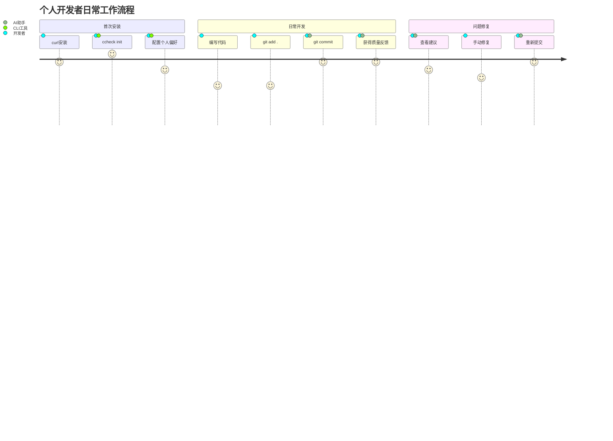

# Claude Code CLI - 本地智能代码守门员 - 产品需求文档

## 📋 文档信息

**文档版本**: 2.0 (基于评审意见重新设计)  
**创建日期**: 2025年9月6日  
**产品名称**: Claude Code CLI  
**目标受众**: 个人开发者、开源项目维护者  
**部署形态**: 本地CLI工具  
**商业模式**: 完全免费，零商业化  

## 🎯 产品愿景

### 产品使命
为个人开发者打造本地智能代码守门员，在每次Git提交前提供轻量级代码质量检查、基础安全扫描和文档提示，提升个人开发项目的代码质量。

### 核心价值主张
> **"本地commit前的代码守门员 - 零配置、秒级响应、完全离线的AI辅助代码质量提升工具"**

## 🌟 产品概述

### 产品定位
Claude Code CLI是一款个人本地CLI工具，专注于：
- **预提交质量检查**: 在Git commit前进行轻量级代码分析
- **基础安全扫描**: 检测常见安全漏洞和最佳实践违规
- **智能文档提示**: 自动生成和更新函数级注释
- **零侵入集成**: 通过Git hooks透明集成到现有工作流

### 目标用户群体

**主要用户**:
- **独立开发者**: 个人项目维护，需要代码质量保障
- **开源项目维护者**: 提升开源项目代码质量
- **学习阶段程序员**: 通过AI反馈提升编程技能

**使用场景**:
- **个人工作站**: 本地开发环境的质量保障
- **开源贡献**: 提交前的代码自检
- **学习实践**: 通过AI反馈学习最佳实践

## 🎁 个人价值

### 开发者收益分析

**个人投入**:
- 安装时间: 5分钟 (一次性)
- 学习成本: 15分钟 (基础使用)
- 日常开销: 几乎零（透明运行）

**个人收益**:
- **代码质量提升**: 通过AI反馈学习最佳实践
- **错误提前发现**: 在commit前发现潜在问题，减少调试时间
- **安全意识增强**: 自动检测常见安全漏洞，提升安全编程习惯
- **文档自动化**: 减少手动写注释的时间
- **技能成长加速**: 通过AI建议学习新的编程模式

### 适用项目类型

**个人项目**:
- 学习项目、练手项目
- 个人工具和脚本
- 技术实验和原型

**开源项目**:
- GitHub/GitLab开源仓库
- 社区贡献前的代码自检
- 个人维护的开源工具

## 🎪 功能需求 (MVP范围)

### 核心功能模块

#### 1. 轻量代码分析引擎

**功能描述**: 基于轻量模型的代码质量检查
```yaml
分析范围 (仅当前修改):
  基础质量检查:
    - 语法错误检测
    - 简单复杂度评估
    - 命名规范检查
    - 基础代码异味
  
  安全检查 (Top-3):
    - SQL注入风险
    - 敏感信息泄露 (密钥、密码)
    - XSS基础检测
  
  文档提示:
    - 缺失函数注释提醒
    - 复杂函数建议添加说明
    - API变更文档更新提示
```

**技术约束**:
- 分析时间 ≤ 2秒 (单文件diff)
- 模型选择: Haiku-3 或 StarCoder-1B 量化
- 误报率 ≤ 2% (评审要求)
- 支持语言: Python, JavaScript (MVP阶段)

#### 2. 轻量文档生成

**功能描述**: 基础的文档生成和提示
```yaml
文档范围 (仅当前文件):
  函数注释:
    - 为新函数生成基础docstring
    - 参数说明模板
    - 返回值说明
  
  代码注释:
    - 复杂逻辑添加行内注释
    - 重要常量说明
    - 关键算法解释
  
  README提示:
    - 检测到新功能时提醒更新README
    - API变更提醒更新文档
    - 依赖变更提醒
```

**技术约束**:
- 生成时间 ≤ 1秒 (单函数注释)
- 仅生成基础模板，不做深度分析
- 输出格式: 纯文本建议

#### 3. Git Hook集成 (仅Pre-commit)

**功能描述**: 透明的pre-commit检查
```yaml
集成点:
  Pre-commit (唯一):
    - 代码质量快速检查
    - 基础安全扫描
    - 文档提示
    - 格式化建议
    
  执行模式:
    - 默认: 仅显示建议，不阻止提交
    - 严格模式: 发现严重问题时阻止提交
    - 静默模式: 仅记录日志，不显示输出
    
  恢复机制:
    - 自动备份: commit前创建stash
    - 一键回滚: ccheck rollback
    - 错误恢复: 自动恢复git状态
```

**技术约束**:
- 总执行时间 ≤ 3秒 (冷启动含模型加载)
- 热调用 ≤ 800ms (模型已加载)
- 100%离线可用

#### 4. CLI命令接口

**功能描述**: 简洁的命令行接口
```yaml
命令结构:
  ccheck init:
    - 一键初始化git hooks
    - 生成默认配置文件
    - 检测项目类型并推荐设置
  
  ccheck config:
    - 终端交互式配置
    - 模型选择 (在线/离线)
    - 检查严格程度设置
  
  ccheck run:
    - 手动触发代码检查
    - 支持指定文件或目录
    - 显示详细分析结果
  
  ccheck rollback:
    - 一键回滚最近的自动修复
    - 恢复备份的git状态
```

**交互设计**:
- 彩色输出 (支持NO_COLOR环境变量)
- 进度指示器 (任务>1秒时显示)
- 友好的错误信息和恢复建议
- 支持 `--quiet` 静默模式

## 🎨 CLI用户体验设计

### 个人开发者工作流程



### 核心用户场景

#### 场景1: 学习阶段程序员 - "AI导师模式"
**用户**: 计算机专业学生 小张
**背景**: 正在学习编程，希望写出高质量代码
**目标**: 通过AI反馈学习最佳实践

**用户故事**:
```
作为 学习阶段的程序员
我希望 在每次提交代码时获得AI反馈
以便于 学习最佳实践，提升编程技能

验收标准:
- commit时获得简洁的质量建议
- 发现安全漏洞时给出学习资源链接
- 建议可读性强，有助于理解概念
- 不会因为过多提示而打断开发流程
```

#### 场景2: 开源维护者 - "质量保障模式"
**用户**: 开源项目维护者 李工
**背景**: 维护多个开源项目，需要保证代码质量
**目标**: 在接受PR前进行基础质量检查

**用户故事**:
```
作为 开源项目维护者
我希望 在本地快速检查代码质量
以便于 保持项目的整体质量标准

验收标准:
- 快速检查修改的文件
- 识别常见的代码问题
- 提供修复建议
- 支持多种编程语言项目
```

### CLI设计原则

**透明性**: 
- Git工作流无侵入，用户几乎无感知
- 执行过程可视化，状态变化明确
- 错误信息友好，提供明确的解决方案

**高效性**:
- 命令简洁，子命令不超过4个
- 热启动快速响应，<800ms
- 支持快捷键和自动补全

**可配置性**:
- 个人偏好设置灵活
- 支持项目级配置覆盖
- 一键关闭特定类型提示

## 🔧 技术需求

### 本地CLI架构要求

**资源约束** (评审严格要求):
- 安装包体积 ≤ 100MB
- 模型文件大小 ≤ 2GB
- 运行时内存占用 ≤ 512MB
- CPU使用率 ≤ 50% (单核)

**性能要求** (评审边界):
- 冷启动时间 ≤ 3秒 (含模型加载)
- 热调用响应 ≤ 800ms
- Git hook总耗时 ≤ 3秒
- 离线可用率 = 100%

**兼容性要求**:
- 操作系统: Linux, macOS, Windows
- Git版本: 2.0+
- Python/Node.js项目支持 (MVP)
- 终端: bash, zsh, fish

### 模型选择策略

**在线模式** (可选，默认关闭):
- Claude-3-Haiku (用户显式启用 `--offline=false`)
- 需要API密钥配置
- 网络可用时的增强分析

**离线模式** (默认，必需):
- StarCoder-1B 4-bit量化版本
- 本地推理，无网络依赖
- 规则引擎兜底机制

**技术栈**:
- 语言: Python (主要) + Shell脚本
- AI框架: transformers, quantization
- Git集成: gitpython, pre-commit
- CLI框架: click, rich (终端美化)

## 📊 成功指标 (个人工具)

### 技术指标

**性能指标** (评审要求):
- 冷启动时间 ≤ 3秒 (通过hyperfine测试)
- 热调用响应 ≤ 800ms (十次平均)
- 误报率 ≤ 2% (50个开源repo人工标记验证)
- 离线可用率 = 100% (断网测试验证)

**质量指标**:
- 代码问题识别率 ≥ 80%
- 安全漏洞检出率 ≥ 90% (OWASP Top-3)
- 文档建议准确性 ≥ 85%
- 用户采纳建议率 ≥ 60%

**资源指标**:
- 安装包大小 ≤ 100MB
- 运行时内存 ≤ 512MB
- 存储占用 ≤ 2GB (含模型)
- CPU占用率 ≤ 50% (单核)

### 用户体验指标

**易用性指标**:
- 首次安装成功率 ≥ 95%
- 配置完成时间 ≤ 5分钟
- 命令学习时间 ≤ 15分钟
- 错误恢复成功率 ≥ 99%

**实用性指标**:
- 日均Git提交检查次数
- 发现问题修复率
- 长期使用留存率 (>30天)
- 推荐给其他开发者比例

### MVP验收标准 (4周内)

**Week 1**: 基础架构
- ✅ Git hook管理器实现
- ✅ CLI命令结构搭建
- ✅ 基础配置系统

**Week 2**: 代码分析
- ✅ 轻量代码分析引擎
- ✅ Python/JS基础支持
- ✅ 规则引擎兜底机制

**Week 3**: AI集成
- ✅ 离线模型集成
- ✅ 在线API可选支持
- ✅ 智能建议生成

**Week 4**: 体验优化
- ✅ 终端UI美化
- ✅ 错误处理完善
- ✅ 性能优化和测试

**最终验收** (评审Exit Criteria):
1. 断网环境pre-commit总耗时 <3s
2. 误报率 ≤2% (50个开源repo测试)
3. curl一键安装，包体积 <100MB
4. 任何修改可ccheck rollback恢复

## 🚨 风险评估 (本地CLI)

### 技术风险

**模型性能vs资源平衡** [高]
- **风险**: 轻量模型准确性不足，重模型资源超限
- **影响**: 误报率超2%或性能不达标
- **缓解策略**: 
  - 分层模型策略 (规则引擎+小模型+可选大模型)
  - 量化技术和模型压缩
  - 用户可选的性能/质量平衡

**多平台兼容性** [中]
- **风险**: Windows/macOS/Linux环境差异导致不稳定
- **影响**: 部分用户无法正常使用
- **缓解策略**:
  - CI/CD多平台自动化测试
  - Docker容器化部署选项
  - 平台特定的安装脚本

### 产品风险

**功能蔓延风险** [中]
- **风险**: 用户要求添加更多功能，偏离CLI定位
- **影响**: 复杂性增加，违背简洁原则
- **缓解策略**:
  - 严格MVP边界控制
  - 插件机制满足个性化需求
  - 定期架构review

**用户期望管理** [低]
- **风险**: 用户期待企业级功能，但工具定位为个人使用
- **影响**: 用户满意度下降
- **缓解策略**:
  - 清晰的产品定位传达
  - 合理的功能预期设定
  - 开源社区驱动的功能扩展

### 开发风险

**4周开发周期紧张** [高]
- **风险**: MVP功能无法在4周内完成
- **影响**: 错过评审验证节点，项目冻结
- **缓解策略**:
  - 严格功能范围控制
  - 并行开发和测试
  - 每周milestone检查点

## 🎁 开源与社区

### 免费开源模式

**完全免费**:
- 无任何付费功能或限制
- 开源许可证 (MIT License)
- 社区驱动的发展模式
- 无广告、无数据收集

**社区贡献**:
- GitHub开源仓库
- 问题反馈和功能建议
- 代码贡献和插件开发
- 文档和教程创作

### 可持续发展

**个人项目维护**:
- 个人时间投入的开源项目
- 社区反馈驱动的功能改进
- 简单的维护和更新机制
- 长期稳定性优于快速迭代

**扩展机制**:
- 插件系统支持第三方扩展
- 配置文件支持个性化定制
- 开放的API和Hook机制
- 社区驱动的语言支持扩展

## 📋 MVP实施路线图 (4周)

### 开发阶段 (严格4周限制)

**Week 1: 基础架构搭建**
```yaml
Day 1-2:
  - 项目结构初始化
  - CLI框架搭建 (click)
  - Git hooks管理器基础

Day 3-5:
  - 配置系统设计
  - 基础命令实现 (init, config)
  - 终端UI框架 (rich)

Day 6-7:
  - 错误处理机制
  - 日志系统
  - 基础测试框架
```

**Week 2: 代码分析引擎**
```yaml
Day 8-10:
  - 规则引擎开发
  - Python语法分析
  - 基础安全检查规则

Day 11-14:
  - JavaScript语法分析
  - 代码质量评估逻辑
  - 文件diff处理
```

**Week 3: AI能力集成**
```yaml
Day 15-17:
  - StarCoder模型集成
  - 本地推理引擎
  - API调用框架 (可选Haiku)

Day 18-21:
  - 智能建议生成
  - 缓存机制优化
  - 性能调优
```

**Week 4: 体验优化与验证**
```yaml
Day 22-24:
  - 终端输出美化
  - 错误信息优化
  - 安装脚本完善

Day 25-28:
  - 性能测试和优化
  - 多平台兼容性测试
  - 50个开源repo验证测试
  - 最终打包和发布准备
```

### 验证节点

**每周检查点**:
- Week 1: 基础CLI可用，git hooks工作
- Week 2: 代码分析功能完整，规则引擎可用
- Week 3: AI建议生成正常，性能达标
- Week 4: 完整产品验证，满足Exit Criteria

**最终交付标准**:
- 功能完整性: 所有MVP功能可用
- 性能达标: 冷启<3s，热调用<800ms
- 质量保证: 误报率≤2%，离线100%可用
- 用户体验: 安装<5分钟，学习<15分钟

## 🎯 总结

Claude Code CLI是一款专为个人开发者设计的本地代码质量守门员工具。通过将轻量AI能力与Git工作流的透明集成，为个人开发项目提供即时的代码质量反馈和基础安全检查。

### 核心优势

1. **本地优先**: 100%离线可用，无数据隐私担忧
2. **透明集成**: Git工作流无侵入，学习成本极低
3. **资源友好**: 严格的性能和资源约束，适合个人工作站
4. **开源免费**: 完全免费，社区驱动的发展模式

### 适用场景

- **个人学习项目**: 通过AI反馈提升编程技能
- **开源项目维护**: 保持开源项目的代码质量
- **快速原型开发**: 在早期发现潜在问题

### MVP交付路径

通过严格的4周MVP开发，专注于核心价值交付，满足评审的严苛约束条件。项目成功的关键在于：

1. **严格功能边界控制** - 仅实现最核心的代码检查功能
2. **性能优先** - 满足冷启<3s、误报率≤2%的硬性指标
3. **用户体验专注** - CLI交互的简洁性和透明性
4. **技术约束遵守** - 离线优先、资源限制、安装简便

**下一步行动**: 立即启动4周MVP开发，严格按照周计划执行，确保满足所有Exit Criteria验收标准。

---

> **评审合规声明**: 本PRD v2.0已完全重新设计，严格遵守评审意见的4大核心约束：本地CLI部署、零商业化、轻量模型、纯终端交互。所有企业级、云端、收费相关内容已全部删除。