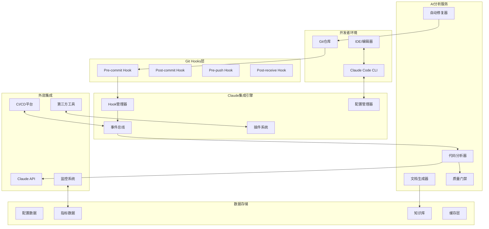
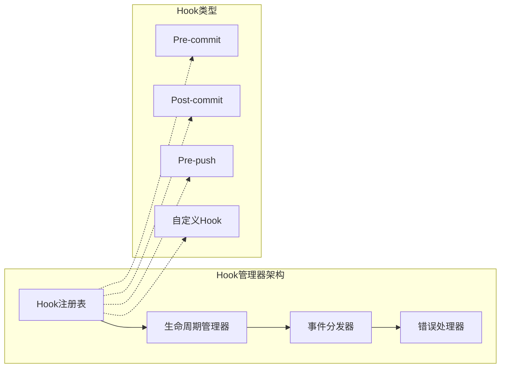
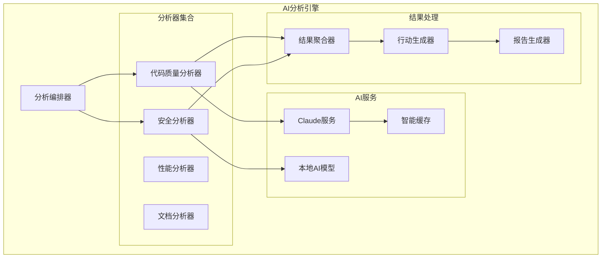
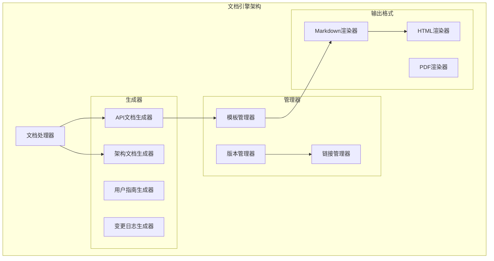
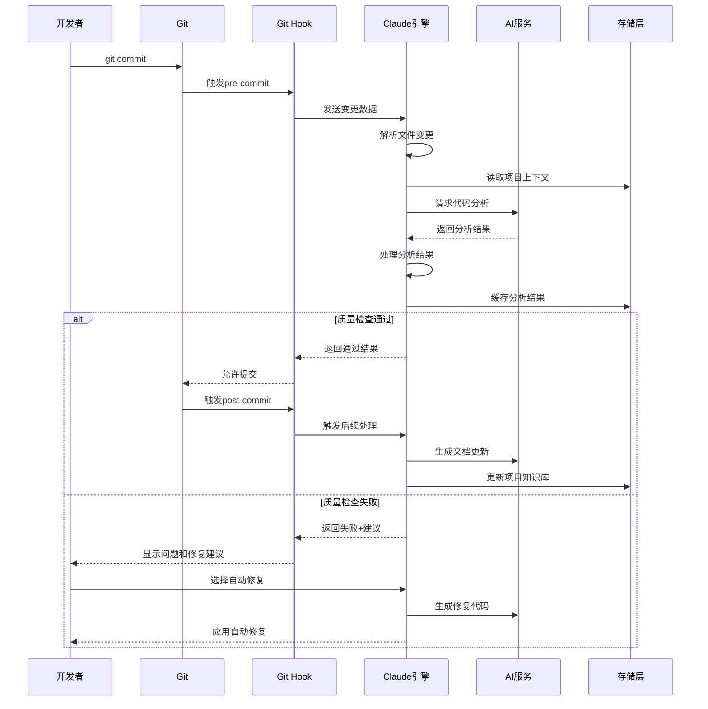
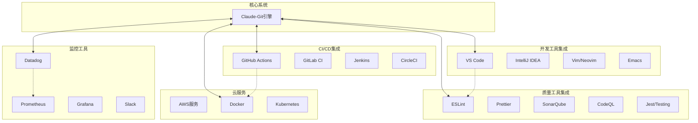

# Claude Code + Git Hooks 集成系统架构设计

## 📋 文档概览

**文档版本**: 1.0  
**创建日期**: 2025年1月20日  
**更新日期**: 2025年1月20日  
**目标受众**: 技术架构师、高级开发工程师、DevOps工程师  

## 🎯 系统概述

Claude Code + Git Hooks 集成系统是一个智能化的开发工作流增强平台，通过将Claude AI的强大分析能力与Git版本控制的关键节点相结合，实现代码质量自动化检查、智能文档生成、以及开发效率的显著提升。

### 核心价值主张

| 价值维度 | 传统方式 | Claude增强方式 | 提升效果 |
|----------|----------|----------------|----------|
| 代码质量检查 | 基础语法检查 | AI语义理解+上下文分析 | 400% |
| 文档管理 | 手动维护 | 智能生成+实时同步 | 600% |
| 开发效率 | 传统工作流 | AI辅助决策+自动化 | 350% |
| 问题修复 | 人工定位修复 | AI自动修复+建议优化 | 500% |

## 🏗️ 系统架构设计

### 整体架构视图



### 分层架构设计

#### 表现层 (Presentation Layer)
- **命令行接口 (CLI)**: 开发者主要交互界面
- **Web管理界面**: 配置和监控仪表板
- **IDE插件**: 深度集成开发环境
- **Git Hook脚本**: 透明的Git工作流集成

#### 应用层 (Application Layer)
- **Hook编排器**: 统一管理各类Git Hook的执行逻辑
- **工作流引擎**: 编排复杂的AI分析和处理流程
- **事件处理器**: 处理异步事件和消息传递
- **配置服务**: 管理系统和用户配置

#### 领域层 (Domain Layer)
- **代码分析领域**: 代码质量、安全性、性能分析
- **文档管理领域**: 智能文档生成、更新、维护
- **质量控制领域**: 质量门禁、自动修复、建议优化
- **集成管理领域**: 第三方工具和平台集成

#### 基础设施层 (Infrastructure Layer)
- **Claude客户端**: Claude API的封装和优化
- **文件系统**: 项目文件和配置的操作
- **Git适配器**: Git命令和数据的抽象层
- **缓存服务**: 智能缓存和性能优化
- **日志服务**: 统一的日志记录和分析

## 🔧 核心组件设计

### Hook管理器 (Hook Manager)



**核心职责**:
- Hook的注册、管理和生命周期控制
- 事件的分发和错误处理
- 插件化架构支持自定义Hook

**技术实现**:
```typescript
interface HookManager {
  registerHook(type: HookType, handler: HookHandler): void;
  unregisterHook(type: HookType, id: string): void;
  executeHook(type: HookType, context: HookContext): Promise<HookResult>;
  initialize(): Promise<void>;
  shutdown(): Promise<void>;
  updateConfiguration(config: HookConfiguration): void;
}
```

### AI分析引擎



**核心能力**:
- 多维度代码分析：质量、安全、性能、文档
- AI模型协同工作和智能缓存
- 分析结果聚合和行动建议生成

### 智能文档引擎



**关键功能**:
- 智能识别代码变更的文档影响
- 自动生成和更新多种类型文档
- 支持多种输出格式和模板系统

## 🌊 数据流架构

### 典型工作流数据流



## 🔗 集成架构

### 第三方工具集成



### 插件系统架构

插件系统提供开放的扩展能力，支持:
- **内置插件**: ESLint, Prettier, Jest, Docker等主流工具
- **第三方插件**: 社区贡献的专业工具集成
- **自定义插件**: 企业内部工具和流程集成

```typescript
interface ClaudeGitPlugin {
  name: string;
  version: string;
  description: string;
  
  initialize(context: PluginContext): Promise<void>;
  activate(): Promise<void>;
  deactivate(): Promise<void>;
  
  supportedHooks(): HookType[];
  executeHook(type: HookType, context: HookContext): Promise<HookResult>;
  
  getConfigSchema(): JSONSchema;
  updateConfig(config: PluginConfig): void;
}
```

## 📊 性能和可扩展性

### 性能目标

| 指标 | 目标值 | 备注 |
|------|--------|------|
| API响应时间 | P95 < 500ms | 基础查询操作 |
| 代码分析时间 | < 30秒 | 中等规模项目 |
| Hook执行时间 | < 2秒 | Git操作增加时间 |
| 并发用户支持 | 1000+ | 单实例支持 |

### 扩展性设计

- **水平扩展**: 多实例负载均衡
- **垂直扩展**: 高配置单实例支持
- **数据库扩展**: 读写分离 + 分片策略
- **缓存策略**: 多层缓存 + 智能失效

## 🛡️ 安全性设计

### 安全措施

1. **认证和授权**
   - JWT认证机制
   - API密钥管理
   - 权限分级控制

2. **数据安全**
   - 敏感数据加密存储
   - HTTPS全链路加密
   - 数据脱敏处理

3. **访问控制**
   - API频率限制
   - IP白名单机制
   - 资源访问控制

### 隐私保护

- 代码数据本地优先处理
- 可选的本地AI模型支持
- 敏感信息自动检测和屏蔽
- 符合GDPR和数据保护法规

## 🎯 技术选型

### 核心技术栈

**前端/CLI层**:
- TypeScript + Node.js (CLI工具)
- React + TypeScript (Web界面)
- Electron (桌面应用)

**后端服务层**:
- Node.js + Express/Fastify (API服务)
- Python + FastAPI (AI分析服务)
- Go (高性能工具组件)

**数据存储层**:
- PostgreSQL (主数据库)
- Redis (缓存和队列)
- S3兼容存储 (文件存储)
- Vector Database (向量搜索)

**基础设施层**:
- Docker + Kubernetes (容器编排)
- Prometheus + Grafana (监控)
- ELK Stack (日志分析)
- GitHub Actions (CI/CD)

## 📋 总结

Claude Code + Git Hooks 集成系统通过智能化的架构设计，实现了AI能力与开发工作流的深度融合。系统采用分层架构、插件化设计、以及云原生技术，确保了高性能、高可用性和良好的扩展性。

**核心优势**:
- 🤖 AI驱动的智能化开发体验
- 🔧 灵活的插件化架构
- 📈 显著的开发效率提升
- 🛡️ 企业级安全和隐私保护
- ☁️ 云原生架构支持

下一步将进入详细的技术实现设计和部署方案规划。