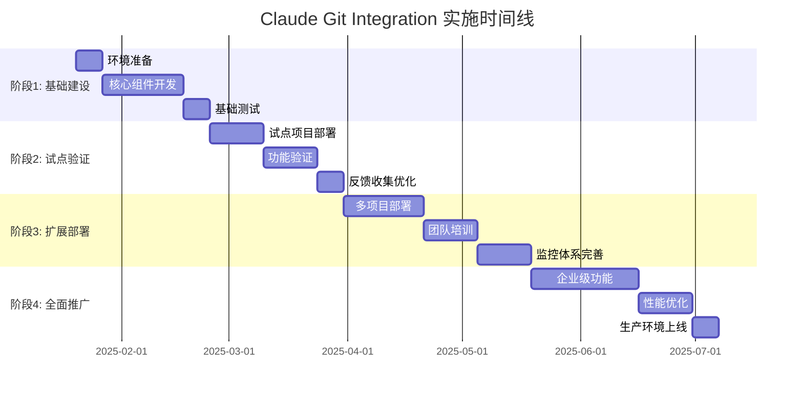
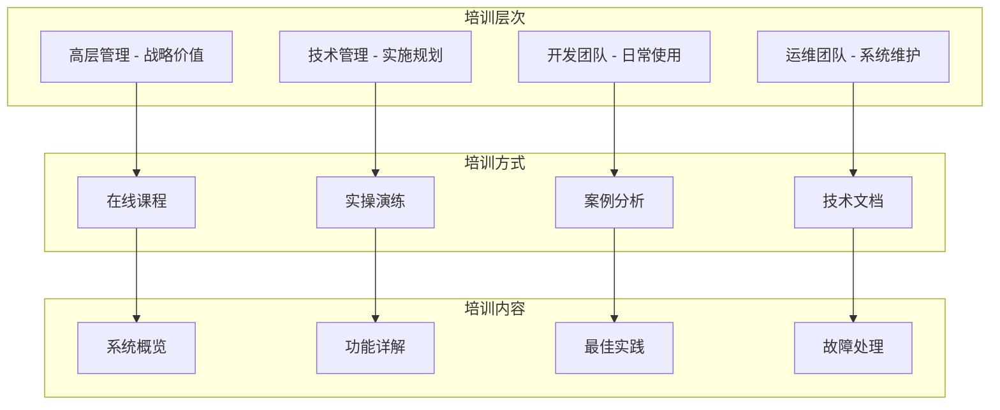

# Claude Code + Git Hooks 实施指南

## 📋 文档信息

**文档版本**: 1.0  
**创建日期**: 2025年1月20日  
**目标受众**: 项目经理、技术负责人、开发团队  
**依赖文档**: [01-系统架构设计](./01-system-architecture.md), [02-技术实现方案](./02-technical-implementation.md)  

## 🎯 实施概览

本指南提供了Claude Code + Git Hooks集成系统的完整实施路径，包括项目规划、分阶段实施、风险管控、团队培训以及成功案例分析。

## 📊 项目实施规划

### 实施策略选择

| 策略类型 | 适用场景 | 实施周期 | 风险等级 | 推荐指数 |
|----------|----------|----------|----------|----------|
| **渐进式部署** | 大型团队，复杂项目 | 12-16周 | 低 | ⭐⭐⭐⭐⭐ |
| **试点项目** | 中型团队，评估阶段 | 6-8周 | 中 | ⭐⭐⭐⭐ |
| **全量部署** | 小型团队，简单项目 | 4-6周 | 高 | ⭐⭐⭐ |

### 推荐实施路径：渐进式部署



## 🚀 分阶段实施方案

### 阶段一：基础建设 (4周)

#### 目标
- 建立核心架构框架
- 实现基础功能模块
- 搭建开发和测试环境

#### 关键任务

**Week 1: 环境准备**
```bash
任务清单:
□ 项目仓库初始化
□ 开发环境搭建 (Docker + Docker Compose)
□ CI/CD流水线配置 (GitHub Actions)
□ 数据库设计和初始化
□ 基础监控配置 (Prometheus + Grafana)

技术要点:
- 使用 Docker 确保环境一致性
- 配置自动化测试流水线
- 建立代码质量门禁
```

**Week 2-4: 核心组件开发**
```typescript
// 开发优先级排序
1. Hook管理器 (核心基础)
   - Hook注册表
   - 生命周期管理
   - 事件分发系统

2. AI分析引擎 (核心价值)
   - Claude服务封装
   - 分析编排器
   - 结果聚合器

3. 配置管理系统 (支撑功能)
   - 项目配置管理
   - 用户偏好设置
   - 缓存系统

4. 基础API (接口层)
   - 认证授权
   - 基础CRUD操作
   - 错误处理中间件
```

#### 验收标准
- [ ] 基础Hook可以正常注册和执行
- [ ] Claude API集成完成，能够进行简单代码分析
- [ ] 配置系统可以读取和保存项目设置
- [ ] API可以正常响应基础请求
- [ ] 自动化测试覆盖率达到80%以上

### 阶段二：试点验证 (5周)

#### 目标
- 在试点项目中验证核心功能
- 收集用户反馈并优化体验
- 建立最佳实践和使用文档

#### 试点项目选择标准
```yaml
ideal_pilot_project:
  team_size: 3-8人
  tech_stack: 主流技术栈 (React/Vue + Node.js/Python)
  complexity: 中等复杂度
  duration: 2-4周开发周期
  openness: 团队对新工具接受度高
  
risk_factors:
  - 避免关键业务项目
  - 避免紧急交付项目
  - 确保有充足的反馈时间
```

#### 关键任务

**Week 1-2: 试点部署**
```bash
部署清单:
□ 试点项目环境配置
□ Git Hooks集成安装
□ 团队成员权限配置
□ 基础培训和演示
□ 问题反馈渠道建立

配置示例:
# .claude-git/config.yaml
project:
  name: "Pilot Project"
  quality_threshold: 7.0  # 适中的质量要求
  auto_fix: true
  analysis_types: ["code-quality", "security"]
```

**Week 3-4: 功能验证**
```typescript
// 验证功能清单
const validationTasks = [
  {
    feature: 'pre-commit-analysis',
    test: '提交代码时自动质量检查',
    success_criteria: '能够阻止低质量代码提交'
  },
  {
    feature: 'auto-documentation',
    test: '自动生成API文档',
    success_criteria: '文档准确性80%以上'
  },
  {
    feature: 'performance-monitoring',
    test: '分析性能和响应时间',
    success_criteria: 'Hook执行时间<3秒'
  }
];
```

**Week 5: 反馈收集和优化**
```markdown
反馈收集方式:
1. 每日使用体验调研 (5分钟快速问卷)
2. 每周团队回顾会议 (30分钟讨论)
3. 问题和建议收集表单 (异步反馈)
4. 使用数据分析 (Hook执行统计)

关键指标:
- 用户满意度评分
- 功能使用频率
- 问题报告数量
- 性能表现数据
```

#### 验收标准
- [ ] 试点团队80%以上成员认为工具有价值
- [ ] Hook执行成功率95%以上
- [ ] 平均代码质量评分提升1分以上
- [ ] 零生产环境影响事故
- [ ] 收集到至少20个有效改进建议

### 阶段三：扩展部署 (7周)

#### 目标
- 将系统扩展到更多项目和团队
- 完善企业级功能
- 建立完整的运维体系

#### 关键任务

**Week 1-3: 多项目部署**
```bash
扩展策略:
1. 选择3-5个不同类型的项目
   - 前端项目 (React/Vue)
   - 后端项目 (Node.js/Python) 
   - 全栈项目
   - 移动端项目 (React Native)

2. 渐进式推进
   Week 1: 项目1-2 部署
   Week 2: 项目3-4 部署
   Week 3: 项目5 + 问题修复

3. 配置标准化
   - 建立项目配置模板
   - 制定最佳实践指南
   - 统一Hook配置策略
```

**Week 4-5: 团队培训**
```markdown
培训计划:

1. 管理层培训 (2小时)
   - 系统价值和ROI分析
   - 实施进展和成果展示
   - 决策支持和资源配置

2. 技术负责人培训 (4小时)
   - 系统架构和技术原理
   - 配置管理和故障处理
   - 最佳实践和优化技巧

3. 开发者培训 (2小时)
   - 日常使用和操作指南
   - 常见问题和解决方案
   - 反馈渠道和支持流程

4. DevOps培训 (3小时)
   - 部署和运维流程
   - 监控和告警配置
   - 性能优化和故障排除
```

**Week 6-7: 监控体系完善**
```yaml
monitoring_setup:
  metrics:
    - hook_execution_time
    - analysis_success_rate
    - user_satisfaction_score
    - system_performance
  
  alerts:
    - hook_failure_rate > 5%
    - analysis_timeout > 30s
    - user_error_reports > 10/day
    - system_resource_usage > 80%
  
  dashboards:
    - executive_summary (业务指标)
    - technical_overview (技术指标)
    - project_details (项目级指标)
    - user_activity (使用情况)
```

#### 验收标准
- [ ] 至少5个项目成功部署并稳定运行
- [ ] 培训完成率90%以上，满意度8分以上
- [ ] 监控体系覆盖所有关键指标
- [ ] 建立完整的运维文档和流程
- [ ] 系统整体可用性99%以上

### 阶段四：全面推广 (7周)

#### 目标
- 实现企业级全面部署
- 优化系统性能和稳定性
- 建立持续改进机制

#### 关键任务

**Week 1-4: 企业级功能开发**
```typescript
// 企业级功能清单
const enterpriseFeatures = [
  {
    name: '多租户支持',
    description: '支持多个组织独立配置和管理',
    priority: 'high',
    effort: '2周'
  },
  {
    name: '审计日志',
    description: '完整的操作日志和合规性报告',
    priority: 'high', 
    effort: '1周'
  },
  {
    name: '权限管理',
    description: '细粒度的用户权限控制',
    priority: 'medium',
    effort: '1.5周'
  },
  {
    name: '批量操作',
    description: '支持批量项目配置和管理',
    priority: 'medium',
    effort: '1周'
  }
];
```

**Week 5-6: 性能优化**
```bash
优化重点:
□ 数据库查询优化 (索引、查询重写)
□ 缓存策略优化 (Redis集群、缓存预热)
□ API性能优化 (连接池、请求合并)
□ 前端加载优化 (代码分割、懒加载)
□ Claude API调用优化 (请求合并、智能缓存)

性能目标:
- API响应时间 P95 < 300ms
- Hook执行时间 < 2秒
- 系统并发支持 1000+ 用户
- 数据库连接复用率 > 90%
```

**Week 7: 生产环境上线**
```yaml
launch_checklist:
  infrastructure:
    - 生产环境服务器配置
    - 负载均衡器配置
    - 数据库主从复制
    - 备份和恢复策略
  
  security:
    - SSL证书配置
    - 防火墙规则设置
    - 访问控制配置
    - 安全扫描通过
  
  monitoring:
    - 监控告警配置
    - 日志收集配置
    - 性能指标dashboard
    - 告警通知渠道
  
  processes:
    - 发布流程文档
    - 回滚计划准备
    - 应急响应预案
    - 用户支持流程
```

#### 验收标准
- [ ] 企业级功能全部开发完成并测试通过
- [ ] 系统性能达到预期目标
- [ ] 生产环境成功上线，零故障运行1周
- [ ] 用户培训和文档完整
- [ ] 建立持续改进和版本迭代机制

## 🎯 成功案例和最佳实践

### 案例一：中型科技公司 (50人开发团队)

**背景**
- 5个活跃项目，技术栈以React + Node.js为主
- 代码质量参差不齐，文档更新滞后
- 团队成员经验水平差异较大

**实施策略**
```markdown
选择渐进式部署策略:
1. 选择最活跃的项目作为试点 (2周)
2. 逐步扩展到其他项目 (4周)
3. 全团队培训和推广 (2周)

关键配置:
- 质量阈值设置为7.5 (适中要求)
- 启用自动修复功能
- 重点关注代码规范和安全检查
```

**实施结果**
| 指标 | 实施前 | 实施后 | 提升 |
|------|--------|--------|------|
| 代码质量评分 | 6.2 | 8.1 | +30.6% |
| 文档覆盖率 | 45% | 82% | +82.2% |
| 代码审查时间 | 2.5h | 1.2h | -52% |
| 缺陷发现率 | 3.2/1000行 | 1.1/1000行 | -65.6% |
| 开发者满意度 | 7.1/10 | 8.9/10 | +25.4% |

**关键经验**
- 从最积极的团队开始试点
- 注重培训和文档建设
- 及时响应用户反馈并快速迭代

### 案例二：大型互联网公司 (200人开发团队)

**背景**
- 20+微服务项目，技术栈多样化
- 高度重视代码质量和安全性
- 已有完善的DevOps体系

**实施策略**
```markdown
采用分批次部署策略:
1. 核心业务线试点 (4周)
2. 其他业务线推广 (8周)
3. 企业级功能定制 (6周)

技术重点:
- 与现有CI/CD系统深度集成
- 定制化企业级功能开发
- 多租户和权限管理
- 高性能和高可用性部署
```

**实施结果**
- 系统支持日均10,000+次Hook执行
- 代码质量评分平均提升1.5分
- 文档自动化程度达到95%
- 安全漏洞检出率提升200%
- ROI达到350% (第一年)

**关键经验**
- 企业级部署需要充分的性能测试
- 与现有工具的集成至关重要
- 定制化功能开发需要预留充足时间

## ⚠️ 风险管控

### 主要风险识别

| 风险类别 | 具体风险 | 影响程度 | 发生概率 | 应对策略 |
|----------|----------|----------|----------|----------|
| **技术风险** | Claude API不稳定 | 高 | 中 | 建立降级机制、本地备用方案 |
| **技术风险** | 性能不满足要求 | 中 | 低 | 提前性能测试、优化方案 |
| **项目风险** | 团队接受度低 | 高 | 中 | 充分培训、渐进式推进 |
| **项目风险** | 实施进度延期 | 中 | 中 | 分阶段交付、风险缓冲时间 |
| **业务风险** | 影响现有开发流程 | 高 | 低 | 试点验证、并行运行 |
| **安全风险** | 代码泄露风险 | 高 | 低 | 数据加密、权限控制 |

### 风险应对措施

#### 1. Claude API依赖风险
```typescript
// 降级策略实现
class AnalysisService {
  async analyzeCode(request: AnalysisRequest): Promise<AnalysisResult> {
    try {
      // 优先使用Claude API
      return await this.claudeAnalysis(request);
    } catch (error) {
      // 降级到本地分析
      console.warn('Claude API unavailable, falling back to local analysis');
      return await this.localAnalysis(request);
    }
  }
  
  private async localAnalysis(request: AnalysisRequest): Promise<AnalysisResult> {
    // 使用ESLint、SonarJS等本地工具
    const eslintResults = await this.runESLint(request.files);
    const securityResults = await this.runSecurityScan(request.files);
    
    return this.aggregateLocalResults(eslintResults, securityResults);
  }
}
```

#### 2. 性能风险控制
```yaml
performance_monitoring:
  alerts:
    - hook_execution_time > 5s
    - api_response_time_p95 > 1s
    - claude_api_timeout_rate > 10%
  
  auto_scaling:
    min_replicas: 3
    max_replicas: 20
    target_cpu_utilization: 70%
  
  circuit_breaker:
    failure_threshold: 5
    recovery_timeout: 30s
    fallback_enabled: true
```

#### 3. 用户接受度风险
```markdown
用户体验优化策略:
1. 渐进式功能开放
   - 先开放基础功能
   - 逐步开放高级功能
   - 根据反馈调整

2. 充分的培训和支持
   - 多层次培训计划
   - 详细的文档和FAQ
   - 及时的技术支持

3. 激励机制
   - 早期采用者奖励
   - 使用效果展示
   - 团队成就分享
```

## 📚 团队培训方案

### 培训体系设计



### 培训内容规划

#### 1. 高层管理培训 (2小时)

**培训目标**
- 理解系统价值和ROI
- 支持实施决策
- 了解实施进展

**培训内容**
```markdown
1. 业务价值分析 (30分钟)
   - 开发效率提升量化分析
   - 代码质量改善预期
   - 成本节约计算

2. 实施策略和进展 (45分钟)
   - 分阶段实施计划
   - 关键里程碑和成果
   - 风险控制措施

3. 成功案例分享 (30分钟)
   - 行业最佳实践
   - 同类公司实施经验
   - 预期收益分析

4. Q&A和决策支持 (15分钟)
```

#### 2. 技术管理层培训 (4小时)

**培训目标**
- 深入理解系统架构
- 掌握配置和管理技能
- 能够指导团队使用

**培训内容**
```markdown
1. 系统架构深度解析 (90分钟)
   - 核心组件和工作原理
   - 数据流和处理逻辑
   - 扩展性和定制化

2. 配置管理实战 (90分钟)
   - 项目配置最佳实践
   - 质量阈值设置策略
   - Hook配置和管理

3. 故障排除和优化 (60分钟)
   - 常见问题诊断
   - 性能监控和调优
   - 系统维护策略

4. 团队管理和推广 (30分钟)
   - 推广策略和方法
   - 团队激励和考核
   - 持续改进机制
```

#### 3. 开发者培训 (2小时)

**培训目标**
- 熟练使用系统功能
- 了解最佳实践
- 能够独立解决常见问题

**培训内容**
```markdown
1. 日常使用指南 (60分钟)
   - Git工作流集成
   - 代码提交流程变化
   - 分析结果理解和处理

2. 高级功能使用 (45分钟)
   - 自动修复功能
   - 文档生成和更新
   - API文档集成

3. 实操演练 (15分钟)
   - 模拟代码提交场景
   - 处理质量检查失败
   - 文档更新操作
```

### 培训效果评估

```typescript
interface TrainingAssessment {
  knowledgeTest: {
    passingScore: number;
    questions: Question[];
  };
  practicalExercise: {
    scenarios: Scenario[];
    completionCriteria: string[];
  };
  feedback: {
    satisfactionRating: number;
    improvementSuggestions: string[];
  };
}

// 评估标准
const assessmentCriteria = {
  management: {
    knowledgeTest: 80, // 80分及格
    keyCompetencies: [
      'ROI计算理解',
      '实施风险识别',
      '资源配置决策'
    ]
  },
  technical: {
    knowledgeTest: 85,
    practicalExercise: '能够独立配置项目',
    keyCompetencies: [
      '系统架构理解',
      '配置管理能力',
      '故障排除技能'
    ]
  },
  developer: {
    knowledgeTest: 75,
    practicalExercise: '能够正常使用所有功能',
    keyCompetencies: [
      '日常操作熟练',
      '问题识别能力',
      '最佳实践应用'
    ]
  }
};
```

## 📈 ROI分析和效益评估

### ROI计算模型

```typescript
interface ROICalculation {
  costs: {
    development: number;      // 开发成本
    deployment: number;       // 部署成本
    training: number;         // 培训成本
    maintenance: number;      // 维护成本
    opportunity: number;      // 机会成本
  };
  benefits: {
    timesSaving: number;      // 时间节省
    qualityImprovement: number; // 质量提升
    defectReduction: number;  // 缺陷减少
    documentationValue: number; // 文档价值
    developerSatisfaction: number; // 开发者满意度
  };
  timeline: {
    breakEvenPoint: number;   // 收支平衡点(月)
    firstYearROI: number;     // 第一年ROI
    threeYearROI: number;     // 三年ROI
  };
}
```

### 标准ROI计算示例

**成本分析 (中型团队50人)**
```yaml
costs:
  development: $150,000     # 开发团队3个月
  deployment: $30,000       # 基础设施和部署
  training: $20,000         # 全员培训
  maintenance: $60,000/year # 运维和支持
  opportunity: $40,000      # 开发期间机会成本
  
total_first_year_cost: $300,000
```

**收益分析**
```yaml
benefits:
  time_savings:
    code_review: $120,000/year    # 代码审查时间减少50%
    documentation: $80,000/year    # 文档维护时间减少70%
    debugging: $100,000/year       # 调试时间减少40%
  
  quality_improvement:
    defect_reduction: $200,000/year # 生产缺陷减少60%
    security_enhancement: $50,000/year # 安全漏洞减少
  
  productivity_gains:
    developer_efficiency: $180,000/year # 开发效率提升25%
    knowledge_sharing: $40,000/year     # 知识传递效率

total_annual_benefits: $770,000
```

**ROI计算结果**
```typescript
const roiCalculation = {
  firstYearROI: (770000 - 300000) / 300000 * 100, // 156.7%
  breakEvenPoint: 300000 / (770000 / 12),         // 4.7个月
  threeYearNPV: calculateNPV([770000, 770000, 770000], 300000, 0.08) // $1,685,000
};
```

## 📋 实施成功要素

### 关键成功因素

1. **高层支持**
   - 明确的实施目标和预期
   - 充足的资源配置
   - 定期的进展跟踪

2. **团队配合**
   - 技术团队的积极参与
   - 业务团队的理解支持
   - 跨部门协作配合

3. **循序渐进**
   - 从小规模试点开始
   - 逐步扩大应用范围
   - 基于反馈持续优化

4. **充分培训**
   - 分层次的培训方案
   - 实操演练和案例分析
   - 持续的技术支持

5. **持续改进**
   - 建立反馈收集机制
   - 定期评估和优化
   - 版本迭代和功能完善

### 实施检查清单

```markdown
准备阶段检查清单:
□ 项目目标和成功标准明确
□ 实施团队和角色分工确定
□ 技术环境和依赖项准备就绪
□ 风险识别和应对措施制定
□ 培训计划和资料准备完成

实施阶段检查清单:
□ 各阶段里程碑和交付物明确
□ 质量控制和测试策略实施
□ 风险监控和应对机制运行
□ 团队协作和沟通渠道畅通
□ 进展跟踪和报告机制建立

验收阶段检查清单:
□ 功能验证和性能测试通过
□ 用户培训和文档交付完成
□ 运维流程和支持体系建立
□ 项目总结和经验归纳完成
□ 后续改进计划制定完成
```

## 📋 实施指南总结

Claude Code + Git Hooks集成系统的实施需要：

- **系统性规划**: 分阶段实施，控制风险
- **充分准备**: 技术、人员、流程全方位准备
- **用户导向**: 关注用户体验和接受度
- **持续改进**: 建立反馈机制，持续优化
- **价值导向**: 明确ROI目标，量化效益

通过遵循本指南的实施路径和最佳实践，可以确保项目的成功实施和长期价值实现。